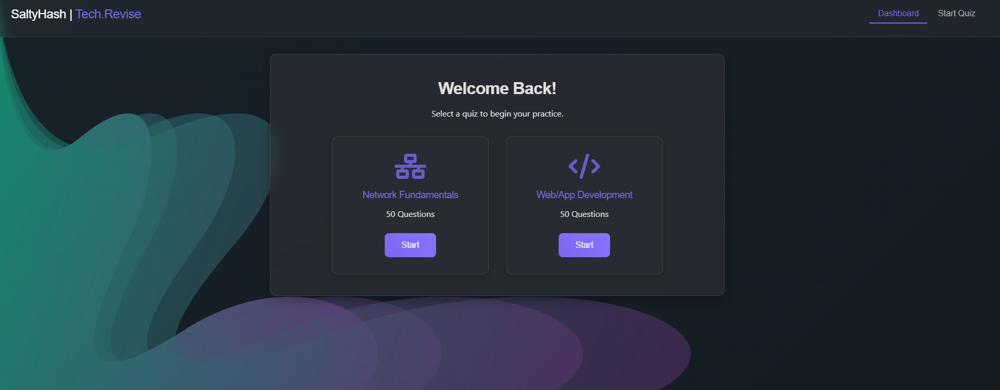

# Tech.Revise - Interactive Quiz Platform


**Part of [SaltyHash.tech](https://saltyhash.tech)** - A comprehensive educational platform

An advanced, interactive quiz application featuring CompTIA Network+ fundamentals and Web/App Development questions. This is the foundational quiz module of the larger SaltyHash.tech educational ecosystem, with many more quiz sections planned for future releases.

## 🚀 Features

- **📚 Current Quiz Categories (More Coming Soon!)**
  - Network Fundamentals (50 CompTIA Network+ questions)
  - Web/App Development (50 comprehensive questions)
  - *Future: Cloud Computing, Cybersecurity, DevOps, AI/ML, and more!*

- **🎯 Interactive Learning Experience**
  - Multiple choice questions with instant feedback
  - Detailed explanations for each answer
  - Helpful hints to guide learning
  - Randomized question order for varied practice

- **💡 Modern UI/UX Design**
  - Professional glassmorphism design with beautiful background
  - Object Sans typography for optimal readability
  - Fully responsive layout for all devices
  - Smooth animations and seamless transitions

- **📊 Advanced Progress Tracking**
  - Real-time progress bar with visual feedback
  - Comprehensive score tracking and performance analytics
  - Detailed results summary with improvement suggestions
  - Quick restart functionality for continuous learning

- **🌐 Part of SaltyHash.tech Ecosystem**
  - Integrated with the larger SaltyHash.tech educational platform
  - Consistent branding and user experience
  - Future integration with user accounts and progress tracking
  - Expandable architecture for unlimited quiz categories

## 🎮 Demo



**Live Demo:** [Tech.Revise on SaltyHash.tech](https://www.saltyhash.tech/lab)  
**Main Site:** [SaltyHash.tech](https://saltyhash.tech)

## 🛠️ Installation

1. **Clone the repository**
   ```bash
   git clone https://github.com/curiousboey/tech.revise.git
   cd tech.revise
   ```

2. **Open in browser**
   ```bash
   # Simply open index.html in your preferred browser
   open index.html  # macOS
   start index.html # Windows
   xdg-open index.html # Linux
   ```

3. **Or serve locally** (recommended)
   ```bash
   # Using Python
   python -m http.server 8000
   
   # Using Node.js
   npx serve .
   
   # Using PHP
   php -S localhost:8000
   ```

## 📁 Project Structure

```
tech.revise/
├── index.html                     # Main HTML file
├── style.css                      # Stylesheet with glassmorphism design
├── script-new.js                  # Main application logic
├── network-fundamentals-quiz.js   # Network+ quiz questions (50)
├── web-app-dev-quiz.js           # Web development quiz questions (50)
├── background.jpg                 # Background image
├── README.md                      # Project documentation
└── LICENSE                        # MIT License
```

## 🎯 Quiz Categories & Roadmap

### Current Categories

#### Network Fundamentals
- **Topics Covered:**
  - OSI Model and TCP/IP Stack
  - Network Protocols (HTTP, HTTPS, FTP, DNS, DHCP)
  - Routing and Switching Concepts
  - Network Security Fundamentals
  - Wireless Networking Standards
  - Network Troubleshooting Methodologies
  - Subnetting and VLAN Configuration
  - Network Performance Optimization

#### Web/App Development
- **Topics Covered:**
  - Frontend Technologies (HTML5, CSS3, JavaScript, TypeScript)
  - Backend Development (Node.js, Python, PHP, Java)
  - Database Management (SQL, NoSQL, MongoDB, PostgreSQL)
  - Modern Frameworks (React, Vue, Angular, Next.js)
  - API Development and RESTful Services
  - DevOps and CI/CD Pipelines
  - Web Security Best Practices
  - Modern Development Tools and Workflows

### 🚀 Future Quiz Categories (Coming to SaltyHash.tech)

#### Phase 1 - Core Technology Stacks
- **Cloud Computing & AWS** (50+ questions)
- **Cybersecurity Fundamentals** (50+ questions)
- **DevOps & Container Technologies** (50+ questions)
- **Database Administration** (50+ questions)

#### Phase 2 - Advanced Specializations
- **Artificial Intelligence & Machine Learning** (50+ questions)
- **Mobile App Development** (50+ questions)
- **Data Science & Analytics** (50+ questions)
- **Blockchain & Cryptocurrency** (50+ questions)

#### Phase 3 - Certification Prep
- **CompTIA Security+** (100+ questions)
- **AWS Solutions Architect** (100+ questions)
- **Google Cloud Professional** (100+ questions)
- **Microsoft Azure Fundamentals** (100+ questions)

#### Phase 4 - Emerging Technologies
- **Internet of Things (IoT)** (50+ questions)
- **Quantum Computing Basics** (50+ questions)
- **Edge Computing** (50+ questions)
- **Augmented Reality Development** (50+ questions)

*Each category will feature the same high-quality format with hints, detailed explanations, and progressive difficulty levels.*

## 🔧 Customization

### Adding New Quiz Categories

1. **Create a new question file** (e.g., `new-category-quiz.js`):
   ```javascript
   const newCategoryQuestions = [
       {
           question: "Your question here?",
           options: ["Option A", "Option B", "Option C", "Option D"],
           answer: 0, // Index of correct answer
           hint: "Helpful hint for the question",
           detailedExplanation: "Detailed explanation of the answer"
       }
       // ... more questions
   ];
   ```

2. **Update the HTML** to include the new script and add a quiz card:
   ```html
   <script src="new-category-quiz.js"></script>
   
   <div class="quiz-card" data-quiz-id="new-category">
       <i class="fas fa-icon quiz-icon"></i>
       <h3>New Category</h3>
       <p>50 Questions</p>
       <button class="start-quiz-btn">Start</button>
   </div>
   ```

3. **Update the JavaScript** to handle the new category in `script-new.js`.

### Styling Customization

The application uses CSS custom properties for easy theming:

```css
:root {
    --primary-color: #8b5fbf;
    --secondary-color: #6a4c93;
    --background-overlay: rgba(0, 0, 0, 0.5);
    --glass-background: rgba(255, 255, 255, 0.1);
    --text-primary: #ffffff;
    --text-secondary: #e0e0e0;
}
```

## 🤝 Contributing

Contributions are welcome! Here's how you can help:

1. **Fork the repository**
2. **Create a feature branch** (`git checkout -b feature/AmazingFeature`)
3. **Commit your changes** (`git commit -m 'Add some AmazingFeature'`)
4. **Push to the branch** (`git push origin feature/AmazingFeature`)
5. **Open a Pull Request**

### Contribution Guidelines

- Follow the existing code style and structure
- Add questions in the established format
- Test thoroughly before submitting
- Update documentation as needed
- Ensure all questions have proper explanations and hints

## 📝 Question Format

Each question follows this structure:

```javascript
{
    question: "What is the primary purpose of the OSI Model?",
    options: [
        "To define network hardware specifications",
        "To standardize network communication protocols",
        "To encrypt network traffic",
        "To manage network bandwidth"
    ],
    answer: 1, // Index of the correct answer (0-based)
    hint: "Think about standardization and communication between different systems",
    detailedExplanation: "The OSI Model provides a standard framework for network communication, allowing different systems to communicate effectively by defining seven distinct layers of network functionality."
}
```

## 🔒 License

This project is licensed under the MIT License - see the [LICENSE](LICENSE) file for details.

## 📧 Contact & Links

**SaltyHash | Tech.Revise**
- 🌐 **Main Website:** [SaltyHash.tech](https://saltyhash.tech)
- 📚 **Quiz Platform:** [SaltyHash.tech/quiz](https://saltyhash.tech/lab)
- 💻 **GitHub:** [@curiousboey](https://github.com/curiousboey)
- 📁 **Repository:** [tech.revise](https://github.com/curiousboey/tech.revise)
- 📧 **Contact:** [LinkedIn](https://www.linkedin.com/in/bhupendra-budha/)

## 🙏 Acknowledgments

- **SaltyHash.tech Community** for continuous feedback and support
- **CompTIA** for Network+ certification standards and guidelines
- **Web Development Community** for best practices and modern standards
- **Open Source Contributors** who help improve the platform
- **Beta Testers** who provide valuable feedback for upcoming features
- **Educational Technology Pioneers** for inspiration and innovation

## 📊 Platform Statistics

- **Current Questions:** 100+ (Network+ and Web Development)
- **Planned Questions:** 1000+ across all categories
- **Active Categories:** 2 (expandable architecture)
- **Future Categories:** 15+ planned for SaltyHash.tech
- **Technologies:** HTML5, CSS3, Vanilla JavaScript
- **Design Philosophy:** Glassmorphism with responsive, accessible layout
- **Performance:** Lightweight, fast loading, optimized for all devices
- **Browser Support:** Modern browsers (Chrome, Firefox, Safari, Edge)
- **Integration:** Seamlessly integrates with SaltyHash.tech ecosystem

---

<div align="center">
  <strong>Made with ❤️ by SaltyHash | Tech.Revise</strong>
  <br>
  <em>Part of the SaltyHash.tech Educational Ecosystem</em>
  <br>
  <em>Empowering learning through interactive, comprehensive quizzes</em>
  <br><br>
  <a href="https://saltyhash.tech">🌐 Visit SaltyHash.tech</a> | 
  <a href="https://www.saltyhash.tech/lab">📚 Try the Quiz Platform</a> | 
</div>
